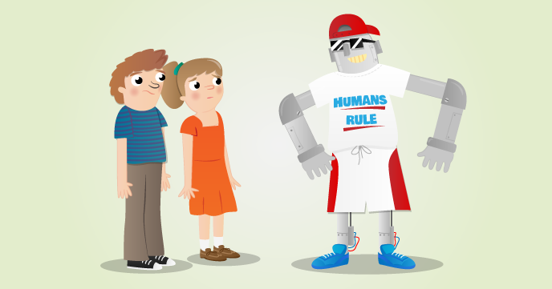

# The Turing Test

This scheme of work has been designed as an introduction to text-based programming using Python on the Raspberry Pi. By the end of all the lessons, students will have created an interactive chat bot and been introduced to the computer science concept of artificial intelligence.

This scheme of work is specifically targeted towards introductory KS2 Computing, although these lessons could be used as a wider scheme of work at KS3. This has been developed in harmony with the new Computing curriculum in the UK.

##Learning outcomes:

Over the course of three lessons, students will learn:

- What a Raspberry Pi is, what its main features are, and how to set up and use one.
- How to program a Raspberry Pi to act as a chat robot.
- What is meant by artificial intelligence, in particular relating to the Turing test.
- The following computer science concepts:
	- Sequencing
	- Debugging
	- User input
	- Print statements

##Computing Programme of Study Met

###KS2:

- Design, write and debug programs that accomplish specific goals; solve problems by breaking them into smaller parts. Select, use and combine a variety of software on a range of digital devices to design and create a range of programs.
- Use sequence, selection and repetition in programs; work with variables and various forms of input and output
- Use logical reasoning to explain how some simple algorithms work; detect and correct errors in algorithms and programs

###KS3:

- Use two or more programming languages, at least one of which is textual, to solve a variety of computational problems.

[National Curriculum Computing Programmes of Study](https://www.gov.uk/government/publications/national-curriculum-in-england-computing-programmes-of-study/national-curriculum-in-england-computing-programmes-of-study#key-stage-3)

##Resources

For the majority of the lesson, it is suggested that work is carried out by students on a Raspberry Pi each or in pairs. Each student or pair should have access to the standard equipment described below:

- A Raspberry Pi per pair
- The latest NOOBS SD card with Raspbian installed per pair
- 'espeak' downloaded and installed on each SD card
- A keyboard and mouse connected to the Raspberry Pi per pair
- A monitor connected to the Raspberry Pi per pair
- A headphone splitter connected to the Raspberry Pi audio jack per pair (from lesson 3 onwards)
- A pair of headphones connected to the splitter per student (from lesson 3 onwards)

*Note: These lessons will use Python 3*.

See the [teacher setup instructions](teacher-instructions.md) for more information.

##Lessons

- [Lesson 1: How do Computers Think?](lesson-1/plan.md)
- [Lesson 2: Can Computers Think for Themselves?](lesson-2/plan.md)
- [Lesson 3: Make a Chatting Robot](lesson-3/plan.md)

## Licence

Unless otherwise specified, everything in this repository is covered by the following licence:

***Turing Test Lessons*** by the [Raspberry Pi Foundation](http://raspberrypi.org) is licenced under a [Creative Commons Attribution 4.0 International License](http://creativecommons.org/licenses/by-sa/4.0/).

Based on a work at https://github.com/raspberrypilearning/turing-test-lessons
